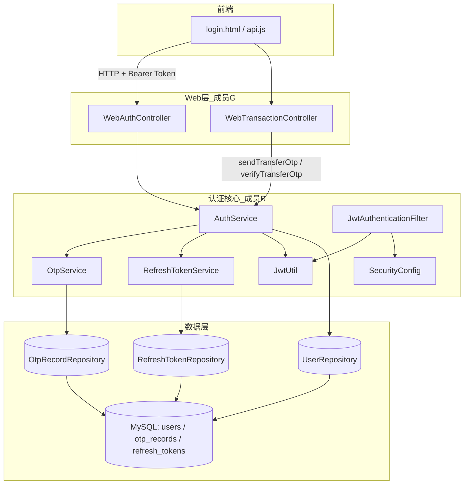

# 成员 B — 认证与安全模块 · 代码功能解读报告

> **面向读者**：刚接触本项目的开发者  
> **模块负责人**：成员 B（认证安全工程师）  
> **代码包路径**：`project/back/src/main/java/com/banking/auth/`  
> **文档版本**：2026-06-12

---

## 1. 这个模块是做什么的？

在线银行系统里，**成员 B 的模块负责「你是谁」和「你有没有权限」**。

可以把它理解成银行大厅的**门卫 + 身份柜台**：

| 现实场景 | 本模块对应功能 |
|----------|----------------|
| 开户登记 | 用户注册 |
| 核实邮箱/手机 | 邮箱 OTP 验证 |
| 出示身份证进大厅 | 登录 + JWT Token |
| 临时通行证续期 | Refresh Token 刷新 |
| 忘记密码 | 发验证码 → 重置密码 |
| 大额转账再确认一次 | 转账邮箱 OTP（TRANSFER_VERIFY） |
| 多次输错密码锁门 | 登录失败锁定 |
| 管理员冻结账户 | 用户状态 LOCKED / DISABLED 校验 |

**成员 B 不负责**：账户余额、转账扣款、账单导出（这些在 C/D/E/G 等模块）。  
但其他模块做敏感操作前，会调用 B 的 `verifyUserActive()`、`verifyTransferOtp()` 等方法做身份与状态检查。

---

## 2. 新手必懂的基础概念

### 2.1 密码不能明文存库

用户注册时，密码会经过 **BCrypt** 加密后再写入数据库。  
登录时用 `passwordEncoder.matches(明文, 密文)` 比对，**永远不回溯明文密码**。

配置位置：`SecurityConfig.passwordEncoder()`，强度为 BCrypt 12 轮。

### 2.2 JWT（JSON Web Token）—— 登录后的「通行证」

登录成功后，系统签发 **Access Token**（短期，默认 1 小时）：

- 前端保存在浏览器（通常 `localStorage`）
- 之后每次请求 API 时在 Header 带上：`Authorization: Bearer <token>`
- 服务端 `JwtAuthenticationFilter` 解析 Token，确认是哪个用户

Token 里大致包含：

- `sub`：用户名
- `userId`：用户 ID
- `role`：角色（`ROLE_USER` 或 `ROLE_ADMIN`）
- `exp`：过期时间

### 2.3 Refresh Token —— 续期用的「长期票」

Access Token 过期后，不必重新输密码，可用 **Refresh Token** 换一对新 Token。  
本项目的 Refresh Token **存在数据库** `refresh_tokens` 表，不是 JWT 字符串（与 Access Token 不同）。

特点：

- 登出时撤销（`revoked = true`）
- 改密码后撤销该用户全部 Refresh Token（强制重新登录）
- 刷新时会**轮换**：旧 Refresh Token 作废，发新的

### 2.4 OTP（One-Time Password）—— 一次性验证码

6 位数字，用于：

| 类型 | 枚举值 | 用途 |
|------|--------|------|
| 注册邮箱验证 | `EMAIL_VERIFY` | 注册后激活账户 |
| 找回密码 | `PASSWORD_RESET` | 重置密码前验证 |
| 大额转账 | `TRANSFER_VERIFY` | 转账金额超阈值时再验证 |
| 登录二步验证 | `LOGIN_MFA` | 预留，可扩展 |

验证码记录在 `otp_records` 表，默认 **5 分钟**有效，用过即作废。  
**开发环境注意**：项目未接真实邮件服务，验证码会打在**后端控制台日志**里，形如：

```text
[OTP 模拟发送] target=zhangsan@test.com type=TRANSFER_VERIFY code=123456 expires=...
```

### 2.5 Spring Security —— 统一的「门禁系统」

`SecurityConfig` 定义：

- 哪些 URL **不用登录**就能访问（白名单）
- 哪些 URL **必须带 Token**
- 未登录 / 无权限时返回 401 / 403 JSON

`JwtAuthenticationFilter` 在每次 HTTP 请求时运行，把 Token 解析成「当前登录用户」，放进 `SecurityContext`。

---

## 3. 模块整体架构



**请求链路（已登录 API）**：

1. 浏览器带 `Authorization: Bearer xxx`
2. `JwtAuthenticationFilter` 解析 Token → 加载用户 → 写入 SecurityContext
3. `SecurityConfig` 判断该 URL 是否需要认证
4. Controller 执行业务（如转账）
5. 业务里可调用 `AuthService.verifyUserActive(userId)` 再次确认用户未被冻结

---

## 4. 文件清单与职责（21 个文件）

### 4.1 实体（Entity）— 与数据库表一一对应

| 文件 | 表名 | 作用 |
|------|------|------|
| `entity/User.java` | `users` | 用户账号：用户名、密码、邮箱、角色、状态等 |
| `entity/RefreshToken.java` | `refresh_tokens` | 长期登录凭证，可撤销 |
| `entity/OtpRecord.java` | `otp_records` | 一次性验证码记录 |

**User 重要字段说明**：

| 字段 | 含义 |
|------|------|
| `role` | `ROLE_USER` 普通用户 / `ROLE_ADMIN` 管理员 |
| `status` | `PENDING_VERIFY` 待验证 / `ACTIVE` 正常 / `LOCKED` 锁定 / `DISABLED` 禁用 |
| `emailVerified` | 邮箱是否已验证 |
| `failedLoginAttempts` | 连续登录失败次数 |
| `lockedUntil` | 因输错密码被临时锁定到何时（可为空） |

`User` 还实现了 Spring Security 的 `UserDetails` 接口，供框架识别「当前用户是谁、有没有被锁」。

### 4.2 DTO — 前后端交互的数据形状

| 文件 | 内容 |
|------|------|
| `dto/AuthRequest.java` | 注册、登录、改密、找回密码、OTP 验证等**入参**，带校验注解（如密码至少 8 位、含大小写和数字） |
| `dto/AuthResponse.java` | 登录结果、注册结果、Token、OTP 发送结果等**出参** |

DTO 只做数据传输，**不写业务逻辑**。

### 4.3 Repository — 数据库访问

| 文件 | 作用 |
|------|------|
| `repository/UserRepository.java` | 查用户、改密码、锁定账户、重置登录失败次数等 |
| `repository/OtpRecordRepository.java` | 存 OTP、查有效验证码、作废旧码、清理过期记录 |
| `repository/RefreshTokenRepository.java` | 存/查/撤销 Refresh Token |

这是 Spring Data JPA 接口，方法名符合约定即可自动生成 SQL。

### 4.4 Service — 核心业务逻辑

| 文件 | 作用 |
|------|------|
| **`service/AuthService.java`** | **核心大脑**：注册、登录、登出、改密、找回密码、转账 OTP、用户状态校验 |
| `service/OtpService.java` | 生成 6 位 OTP、校验、防刷、定时清理 |
| `service/RefreshTokenService.java` | 创建/验证/撤销 Refresh Token |
| `service/CustomUserDetailsService.java` | 按用户名从数据库加载用户，供 Security 使用 |

### 4.5 工具与过滤器

| 文件 | 作用 |
|------|------|
| `util/JwtUtil.java` | 签发/解析/校验 JWT |
| `util/OtpUtil.java` | 用安全随机数生成 6 位数字 OTP |
| `filter/JwtAuthenticationFilter.java` | 每个请求解析 Header 里的 Bearer Token |

### 4.6 配置与异常

| 文件 | 作用 |
|------|------|
| `../banking/config/SecurityConfig.java` | Spring Security 总配置：白名单、无 Session、JWT 过滤器、401/403 响应 |
| `exception/AuthException.java` | 认证相关异常及 HTTP 状态码（如用户已存在 409、账户锁定 423） |

### 4.7 测试

| 文件 | 作用 |
|------|------|
| `AuthServiceTest.java` | 单元测试：注册、登录、锁定等（Mock 数据库） |
| `JwtUtilTest.java` | 测试 Token 生成与解析 |
| `AdminPasswordHashTest.java` | 生成管理员密码 BCrypt 哈希 |
| `SeedPasswordHashTest.java` | 生成测试用户密码哈希，便于写 SQL 种子数据 |

---

## 5. 核心功能流程详解

### 5.1 用户注册

```
用户填表 → WebAuthController.register → AuthService.register
```

**步骤**：

1. 检查用户名、邮箱、手机号是否已被占用
2. BCrypt 加密密码
3. 新建用户，默认状态 `PENDING_VERIFY`（待邮箱验证）
4. 调用 `OtpService.generateAndSend(email, EMAIL_VERIFY)` 发验证码
5. 返回「注册成功，请查收邮件」

**注册后不能直接登录**，必须先完成邮箱验证，状态变为 `ACTIVE`。

### 5.2 邮箱验证

```
用户输入 6 位码 → POST /api/auth/verify-email → AuthService.verifyEmail
```

**步骤**：

1. 根据邮箱找到用户
2. `OtpService.verify` 校验验证码是否正确、未过期、未使用
3. 标记 OTP 已使用
4. 更新用户：`emailVerified=true`，`status=ACTIVE`

### 5.3 用户登录

```
POST /api/auth/login → AuthService.login
```

**步骤**：

1. 按用户名查用户；不存在则报「用户名或密码错误」（不暴露具体哪项错）
2. `checkAccountStatus`：待验证 / 禁用 / 冻结 → 拒绝登录
3. BCrypt 比对密码
   - **失败**：失败次数 +1；≥5 次 → 锁定 30 分钟
   - **成功**：清零失败次数，更新 `lastLoginAt`
4. `JwtUtil.generateAccessToken` 生成 Access Token
5. `RefreshTokenService.create` 生成 Refresh Token 入库
6. 返回 Token + 用户信息（含 `role`，前端据此跳转用户页或管理后台）

### 5.4 Token 刷新

```
POST /api/auth/refresh?refreshToken=xxx → AuthService.refreshToken
```

**步骤**：

1. 验证 Refresh Token 存在、未过期、未撤销
2. **撤销旧 Refresh Token**（防止被盗后长期使用）
3. 签发新的 Access Token + 新的 Refresh Token

### 5.5 登出

```
AuthService.logout(refreshToken) → 将该 Refresh Token 标记 revoked
AuthService.logoutAll(userId)   → 撤销该用户所有设备上的 Refresh Token
```

Access Token 本身无状态，过期即失效；登出主要撤销 Refresh Token。

### 5.6 修改密码（已登录）

```
AuthService.changePassword(userId, oldPassword, newPassword)
```

1. 校验旧密码
2. 更新新密码（BCrypt）
3. **撤销全部 Refresh Token** → 其他设备需重新登录

### 5.7 找回密码

**第一步 — 发验证码**：

```
AuthService.forgotPassword(email) → OtpService.generateAndSend(email, PASSWORD_RESET)
```

若 5 分钟内已有有效 OTP，会报「请等待后重试」，防止刷接口。

**第二步 — 重置**：

```
AuthService.resetPassword(email, code, newPassword)
```

1. OTP 校验通过
2. 更新密码
3. 撤销全部 Refresh Token

### 5.8 大额转账 OTP（与 G 模块协作）

当转账金额超过配置阈值（默认 5000 元，见 `application.yml` 的 `transaction.transfer.otp-threshold`）时：

**发码**：

```
POST /api/transactions/transfer/send-otp → AuthService.sendTransferOtp(userId)
```

- 向用户邮箱发送 `TRANSFER_VERIFY` 类型 OTP
- 控制台日志可见验证码

**转账时校验**（在 `WebTransactionController` 中）：

```
AuthService.verifyTransferOtp(userId, request.getOtpCode())
```

验证码正确且未使用后，才执行转账。

> **部署注意**：数据库 `otp_records.type` 列须为 `VARCHAR(30)`，若仍是旧版 ENUM 会导致 `TRANSFER_VERIFY` 写入失败。迁移脚本由成员 J 维护：`project/back/sql/fix-otp-type-column.sql`。

### 5.9 用户状态校验（给其他模块调用）

```java
authService.verifyUserActive(userId);
```

转账、开户等接口在执行业务前会调用，确保用户：

- 不是 `PENDING_VERIFY`
- 不是 `DISABLED`
- 不是 `LOCKED`（含管理员冻结、临时锁定）

---

## 6. 用户状态与登录结果对照

| status | 能否登录 | 典型原因 |
|--------|----------|----------|
| `PENDING_VERIFY` | 否 | 注册后未验证邮箱 |
| `ACTIVE` | 是 | 正常用户 |
| `LOCKED` + `lockedUntil` 未来 | 否 | 连续 5 次密码错误，临时锁 30 分钟 |
| `LOCKED` + `lockedUntil` 为空 | 否 | **管理员冻结**（测试里「无锁定截止时间」即此类） |
| `DISABLED` | 否 | 管理员禁用 |

相关测试示例（`AuthServiceTest`）：

```java
// 管理员冻结：status=LOCKED 且 lockedUntil=null → 提示「冻结」
activeUser.setStatus(User.UserStatus.LOCKED);
activeUser.setLockedUntil(null);
assertThatThrownBy(() -> authService.login(...))
    .isInstanceOf(AuthException.AccountLockedException.class)
    .hasMessageContaining("冻结");
```

---

## 7. Spring Security 白名单（无需 Token）

`SecurityConfig` 中部分路径 **`permitAll`**，例如：

| 类型 | 路径示例 |
|------|----------|
| 页面 | `/login`, `/register`, `/dashboard`, `/admin/**` |
| 认证 API | `/api/auth/login`, `/api/auth/register`, `/api/auth/verify-email` |
| 静态资源 | `/static/**` |
| 文档 | `/swagger-ui/**` |

**需要登录**的典型路径：

- `/api/accounts/**`、 `/api/transactions/**`、 `/api/bills/**`
- `/api/admin/**`（还需管理员角色）

未带 Token 访问受保护 API：

- 浏览器访问页面 → 重定向 `/login`
- API 请求 → JSON `{ "code": 401, "message": "未认证，请先登录" }`

---

## 8. 配置项（application.yml，由成员 I 维护）

成员 B 依赖以下配置（节选）：

```yaml
jwt:
  secret: ...                    # JWT 签名密钥（Base64）
  access-token-expiration: 3600000   # Access Token 1 小时（毫秒）
  refresh-token-expiration: 604800000 # Refresh Token 7 天

otp:
  expiration: 300000             # OTP 5 分钟有效
  length: 6                      # 6 位数字
```

---

## 9. 数据库表结构（由成员 J 维护 schema.sql）

### users

存储所有登录账号，是账户模块（C）的外键来源：`accounts.user_id → users.id`。

### refresh_tokens

| 字段 | 说明 |
|------|------|
| `token` | 长随机字符串 |
| `user_id` | 所属用户 |
| `revoked` | 是否已撤销 |
| `expires_at` | 过期时间 |

### otp_records

| 字段 | 说明 |
|------|------|
| `target` | 邮箱或手机 |
| `code` | 6 位验证码 |
| `type` | EMAIL_VERIFY / PASSWORD_RESET / TRANSFER_VERIFY 等 |
| `used` | 是否已使用 |
| `expires_at` | 过期时间 |

---

## 10. 与其他模块如何配合

| 模块 | 协作方式 |
|------|----------|
| **G（Web API）** | `WebAuthController` 调用 `AuthService`；`WebTransactionController` 调用转账 OTP |
| **C（账户）** | 通过 `userId` 关联；`BankUserDetails` 在 JWT 过滤器里携带 userId |
| **F（管理后台）** | 管理员修改用户 status；B 的 `checkAccountStatus` 在登录/交易时生效 |
| **I（配置）** | `application.yml` 中 jwt、otp、转账阈值 |
| **J（SQL）** | `users` / `otp_records` / `refresh_tokens` 表及迁移脚本 |

---

## 11. 本地调试建议（新手）

### 11.1 看 OTP 验证码

启动后端后，在 IDEA 控制台搜索：

```text
[OTP 模拟发送]
```

后面的 `code=xxxxxx` 即为当前有效验证码。

### 11.2 推荐测试账号

| 用户名 | 密码 | 状态 |
|--------|------|------|
| admin | Admin@123 | 管理员，进 `/admin/dashboard` |
| zhangsan | Password1 | 普通用户，已激活 |

数据来自 `project/back/sql/seed-test-data.sql`（成员 J）。

### 11.3 跑单元测试

```bash
cd project/back
mvn test -Dtest=AuthServiceTest,JwtUtilTest
```

`AuthServiceTest` 使用 Mock，不依赖真实数据库，适合理解业务规则。

### 11.4 常见问题

| 现象 | 可能原因 |
|------|----------|
| 登录后 API 仍 401 | 前端未带 `Authorization: Bearer ...` |
| 注册后无法登录 | 未完成邮箱验证，status 仍为 PENDING_VERIFY |
| 发转账 OTP 无反应 | 未重启服务；或数据库 OTP 类型列未迁移 |
| 提示「验证码已发送请等待」 | 5 分钟内重复点击，等过期或换场景 |
| 管理员被踢到登录页 | Token 过期；或 admin 访问了需用户角色的 API |

---

## 12. 代码阅读顺序（建议）

若你是第一次读成员 B 的代码，建议按下面顺序：

1. `entity/User.java` — 理解用户有哪些状态  
2. `entity/OtpRecord.java` — 理解 OTP 类型  
3. `SecurityConfig.java` — 理解哪些接口要登录  
4. `JwtAuthenticationFilter.java` — 理解 Token 如何变成「当前用户」  
5. **`AuthService.java`** — 核心业务（重点）  
6. `OtpService.java` — OTP 怎么生成和校验  
7. `RefreshTokenService.java` + `JwtUtil.java`  
8. `AuthServiceTest.java` — 用测试用例反推业务规则  

---

## 13. 小结

成员 B 的认证安全模块完成了在线银行系统的**身份生命周期管理**：

- **注册 → 验证 → 登录 → 持 Token 访问 → 刷新/登出**
- **密码与 OTP 双因素**保障敏感操作
- **失败锁定 + 状态机**防止暴力破解与非法账户操作
- 通过 **JWT 过滤器 + Security 配置** 与全站其他 API 统一鉴权

掌握 `AuthService` 一条主线，再对照 `OtpService`、`JwtUtil`、`SecurityConfig`，即可理解本模块 80% 以上的行为。其余文件多为实体、DTO、仓储和测试支撑，可按需查阅。

---

*本报告依据当前仓库源码整理，若代码有更新请以实际实现为准。*
