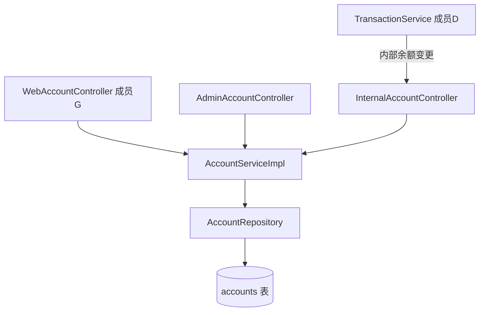

# 成员 C — 账户管理模块 · 代码功能解读报告

> **面向读者**：刚接触本项目的开发者  
> **模块负责人**：成员 C（账户模块开发）  
> **代码包路径**：`project/back/src/main/java/com/bank/account/`  
> **文档版本**：2026-06-12

---

## 1. 这个模块是做什么的？

成员 C 管理**银行账户本身**——不是「用户登录账号」（那是 B 的 `users` 表），而是用户名下的**存款账户**：

| 现实场景 | 本模块功能 |
|----------|------------|
| 开立活期/储蓄账户 | `createAccount` |
| 查余额 | `getBalance` / 账户详情 |
| 改账户别名、限额 | `updateAccount` |
| 冻结账户 | 状态改为 `FROZEN` |
| 内部扣款/入账 | `updateBalanceInternal`（给 D 交易模块调用） |

每个账户有唯一 **账户号**（如 `ACC202606120000001`），通过 `user_id` 关联 B 模块的用户。

---

## 2. 新手必懂的基础概念

### 2.1 用户 vs 账户

- **用户（User）**：能登录系统的人，1 个用户可有多个账户  
- **账户（Account）**：存钱的「罐子」，有余额、类型、状态

### 2.2 账户号规则

`AccountNumberGenerator` 生成格式：`ACC` + 日期 + 序号，保证唯一。

### 2.3 账户状态

| 状态 | 含义 | 能否转账 |
|------|------|----------|
| `ACTIVE` | 正常 | 是 |
| `FROZEN` | 冻结 | 否 |
| `CLOSED` | 已注销 | 否 |

### 2.4 BankUserDetails

JWT 过滤器解析 Token 后，需要知道 **userId**。  
`BankUserDetails`（C 维护）在用户名之外额外携带 `userId`，供 `@AuthenticationPrincipal` 使用。

---

## 3. 模块架构



---

## 4. 文件清单（22 个）

### 4.1 实体与枚举

| 文件 | 说明 |
|------|------|
| `entity/Account.java` | 账户号、userId、类型、余额、日转账限额等 |
| `enums/AccountType.java` | `CHECKING` 活期 / `SAVINGS` 储蓄 |
| `enums/AccountStatus.java` | ACTIVE / FROZEN / CLOSED |

### 4.2 核心服务

| 文件 | 说明 |
|------|------|
| `service/AccountService.java` | 接口定义 |
| **`service/AccountServiceImpl.java`** | **核心业务实现** |

### 4.3 控制器

| 文件 | 面向谁 | 说明 |
|------|--------|------|
| `controller/AdminAccountController.java` | 管理员 API | 查全平台账户、改状态（F 的 UI 调用） |
| `controller/InternalAccountController.java` | 内部服务 | 余额更新，仅服务间调用 |

### 4.4 其他

- **DTO**：`CreateAccountRequest`、`AccountResponse`、`BalanceResponse` 等  
- **异常**：`AccountNotFoundException`、`InsufficientBalanceException` 等  
- **Repository**：`AccountRepository` — JPA 数据访问  
- **测试**：`AccountServiceTest.java`

---

## 5. 核心功能详解

### 5.1 开户 `createAccount`

**流程**：

1. `validateUserCanOpenAccount` — 确认用户存在且状态正常  
2. `generateUniqueAccountNumber()` — 生成不重复账户号  
3. 构建 `Account`：默认 `ACTIVE`，余额可为初始存款  
4. `accountRepository.save`

**注意**：开户不经过现金交易流水，初始余额直接写入（简化模型）。

### 5.2 查询账户

| 方法 | 权限 |
|------|------|
| `getAccountsByUserId` | 只看自己的 |
| `getAccountByNumber` | 校验 `checkOwnership` — 账户必须属于当前 userId |
| `adminGetAllAccounts` | 管理员分页查全部 |

### 5.3 更新与状态变更

- 用户可改：别名、备注、日转账限额（不能改已 `CLOSED` 账户）  
- `changeAccountStatus` / `adminChangeAccountStatus`：冻结、解冻、注销  
- 管理员操作会通过 `AdminAuditHelper` 记操作日志（F 模块）

### 5.4 内部余额更新 `updateBalanceInternal`

交易模块 D 在转账/存取款时**不直接改表**，而是通过内部接口或共享 `AccountRepository` 在事务内更新余额。  
`AccountServiceImpl` 提供校验方法 `validateAccountForTransaction`：账户存在、ACTIVE、余额足够。

### 5.5 余额查询 `getBalance`

返回账户号、余额、币种、更新时间等，供首页和转账页展示。

---

## 6. 数据表 accounts（结构由 J 维护）

关键字段：

| 字段 | 说明 |
|------|------|
| `account_number` | 唯一账户号 |
| `user_id` | 所属用户 |
| `balance` | 余额 DECIMAL(18,2) |
| `daily_transfer_limit` | 日转账限额 |
| `status` | ACTIVE/FROZEN/CLOSED |

---

## 7. 与其他模块协作

| 模块 | 关系 |
|------|------|
| **B** | `user_id` 外键；`BankUserDetails` 供 JWT 使用 |
| **D** | 转账时锁账户、改余额、写流水 |
| **G** | `WebAccountController` 暴露 `/api/accounts/**` |
| **E** | 报表按 `accountId` 查交易，先校验账户归属 |
| **F** | 管理端账户页调 `AdminAccountController`；冻结用户时可能联动冻结账户 |

---

## 8. 本地调试

```bash
# 登录 zhangsan 后
GET /api/accounts/my
Authorization: Bearer <token>
```

种子数据见 `seed-test-data.sql`：张三有 `ACC202606120000001` 等账户。

单元测试：

```bash
cd project/back
mvn test -Dtest=AccountServiceTest
```

---

## 9. 推荐阅读顺序

1. `entity/Account.java`  
2. `enums/AccountStatus.java`  
3. **`AccountServiceImpl.java`**（重点）  
4. `AdminAccountController.java`  
5. `AccountServiceTest.java`  

---

## 10. 小结

成员 C 的模块是**资金存放的账户实体**：开户、查余额、改信息、冻结，并为交易模块提供可靠的余额与状态校验。掌握 `AccountServiceImpl` 即可理解大部分账户业务。
