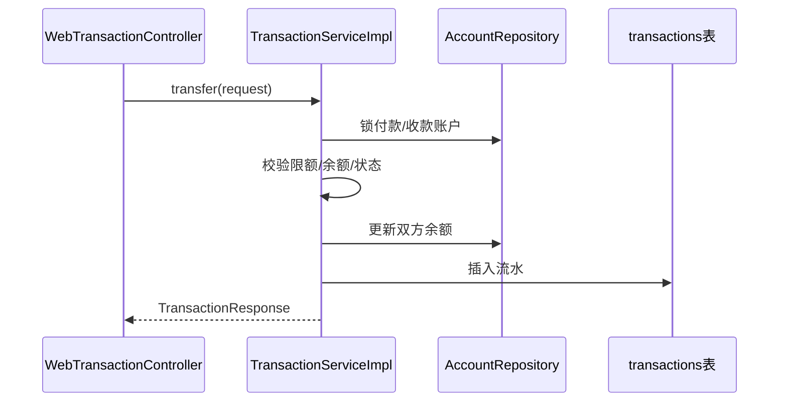

# 成员 D — 交易处理模块 · 代码功能解读报告

> **面向读者**：刚接触本项目的开发者  
> **模块负责人**：成员 D（交易模块开发）  
> **代码包路径**：`project/back/src/main/java/com/bank/transaction/`  
> **文档版本**：2026-06-12

---

## 1. 这个模块是做什么的？

成员 D 负责**钱的流动**：转账、存款、取款，并留下**交易流水**。

| 操作 | 余额变化 | 流水类型 |
|------|----------|----------|
| 转账 | 付款账户减少，收款账户增加 | `TRANSFER_OUT` / `TRANSFER_IN` |
| 存款 | 账户增加 | `DEPOSIT` |
| 取款 | 账户减少 | `WITHDRAW` |

可以把它理解成银行柜台的**记账本 + 出纳**：动钱必须记账，出错要回滚。

---

## 2. 新手必懂的基础概念

### 2.1 数据库事务 `@Transactional`

转账涉及**两个账户**同时改余额。要么都成功，要么都失败回滚。  
`TransactionServiceImpl` 使用：

- `@Transactional(rollbackFor = Exception.class)`  
- 隔离级别 `REPEATABLE_READ`

### 2.2 悲观锁与死锁预防

并发转账时，两个用户可能互相锁对方账户导致**死锁**。  
本模块做法：按账户 **ID 升序** 依次 `SELECT ... FOR UPDATE` 加锁。

```java
if (fromId < toId) {
    lockAccount(fromId);
    lockAccount(toId);
} else {
    lockAccount(toId);
    lockAccount(fromId);
}
```

### 2.3 流水号

每笔成功交易有唯一号，如 `TXN20260612...`，由 `TransactionNoGenerator` 生成。

### 2.4 限额

`TransactionProperties` 从 `application.yml` 读取（I 维护）：

- 单笔转账上限 `single-limit`  
- 日累计 `daily-limit`  
- 最小金额 `min-amount`

超额抛 `TransactionLimitException`。

### 2.5 手续费

转账可能扣手续费（费率来自 F 的 `AdminRuntimeConfigService` / `system_config` 表）。

---

## 3. 模块架构



---

## 4. 文件清单（19 个）

| 分类 | 文件 | 说明 |
|------|------|------|
| 配置 | `TransactionNoGenerator.java` | 流水号 |
| 配置 | `TransactionProperties.java` | 限额配置绑定 |
| 实体 | `Transaction.java` | 流水记录 |
| 枚举 | `TransactionType.java` | 转账/存款/取款等 |
| 枚举 | `TransactionStatus.java` | SUCCESS / FAILED 等 |
| 服务 | **`TransactionServiceImpl.java`** | 核心逻辑 |
| 仓储 | `TransactionRepository.java` | 查流水、统计日累计 |
| 异常 | `BusinessException`、`InsufficientBalanceException` 等 | |
| DTO | `TransferRequest`、`DepositRequest` 等 | |
| 测试 | `TransactionServiceTest.java` | |

---

## 5. 转账流程（逐步）

`TransactionServiceImpl.transfer()`：

1. **参数**：不能转给自己；金额 ≥ min、≤ single-limit  
2. **加锁**：按 ID 顺序锁两个 `Account`  
3. **状态**：双方必须 `ACTIVE`  
4. **日限额**：查今日该账户已转出总额 + 本次 ≤ daily-limit  
5. **手续费**：`totalDebit = amount + fee`  
6. **余额**：付款账户余额 ≥ totalDebit  
7. **改余额**：`from -= totalDebit`，`to += amount`  
8. **写流水**：记录前后余额、操作人 IP、备注  
9. 返回 `TransactionResponse`

**OTP 校验不在 D**：G 的 `WebTransactionController` 在调用 D 之前由 B 校验大额转账验证码。

---

## 6. 存款与取款

### 存款 `deposit`

- 锁账户 → 校验 ACTIVE → 金额合法 → 余额增加 → 写 `DEPOSIT` 流水

### 取款 `withdraw`

- 类似转账出账：锁账户 → 余额足够 → 扣款 → 写 `WITHDRAW` 流水  
- **取款密码校验在 G 层**：`authService.verifyLoginPassword`

---

## 7. 异常与错误码

| 异常 | 典型原因 |
|------|----------|
| `InsufficientBalanceException` | 余额不足 |
| `TransactionLimitException` | 超单笔/日限额 |
| `BusinessException(4005)` | 转给自己、账户号格式错误等 |
| `AccountStatusException` | 账户冻结/注销 |

G 的 `GlobalExceptionHandler` 把这些转成前端能读的 JSON。

---

## 8. 与其他模块协作

| 模块 | 协作 |
|------|------|
| **C** | 读写 `accounts` 表余额 |
| **B** | G 先调 B 校验用户状态、转账 OTP |
| **G** | 把 Web DTO 转成 D 的 `TransferRequest`，传 `userId`、IP |
| **E** | 读 `transactions` 表做报表 |
| **F** | 手续费率 `transfer_fee_rate`；管理端看全平台流水 |
| **I** | `transaction.*` 配置 |
| **J** | `transactions` 表结构 |

---

## 9. 本地调试

1. 用 zhangsan 登录，账户 `ACC202606120000001`  
2. 向 `ACC202606120000003`（李四）转 1000 元 — 无需 OTP  
3. 转 6000 元 — 需先在 G 调 `/api/transactions/transfer/send-otp`，再在转账 body 带 `otpCode`

```bash
mvn test -Dtest=TransactionServiceTest
```

---

## 10. 推荐阅读顺序

1. `entity/Transaction.java`  
2. `TransactionProperties.java`  
3. **`TransactionServiceImpl.java`**（重点读 transfer 方法）  
4. `TransactionServiceTest.java`  

---

## 11. 小结

成员 D 实现**资金变动的核心记账逻辑**：事务、锁、限额、流水号。前端和 OTP 在 G/B，账户实体在 C，D 专注「在同一事务里安全地改两个余额并记一笔账」。
