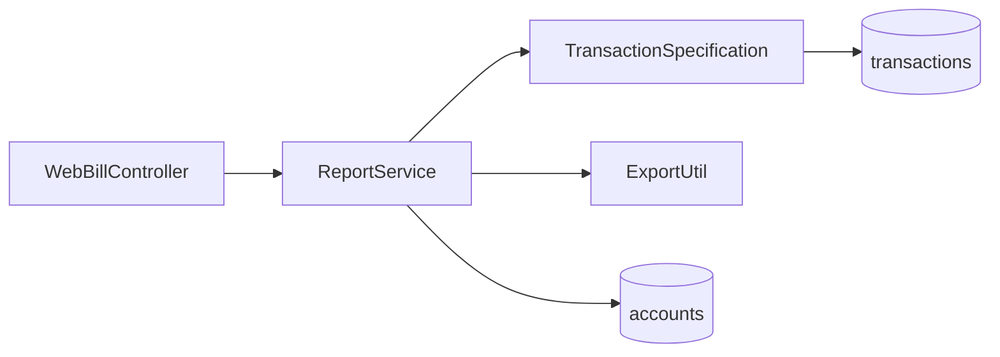

# 成员 E — 账单与报表模块 · 代码功能解读报告

> **面向读者**：刚接触本项目的开发者  
> **模块负责人**：成员 E（报表模块开发）  
> **代码包路径**：`project/back/src/main/java/com/banking/report/`  
> **文档版本**：2026-06-12

---

## 1. 这个模块是做什么的？

成员 E 负责**查历史、算统计、导出文件**——用户想知道「这笔钱什么时候转的」「这个月花了多少」，都由本模块回答。

| 功能 | 说明 |
|------|------|
| 交易历史分页 | 按账户、时间、类型筛选 |
| 交易详情 | 单笔流水号查询 |
| 账户统计 | 某时间段收入/支出汇总 |
| 导出 | CSV、Excel、PDF 下载 |

**不负责**：产生新交易（D）、改余额（C）、对外 REST 路径（G 的 `WebBillController`）。

---

## 2. 新手必懂的基础概念

### 2.1 只读查询

报表模块**几乎不修改数据**，方法上多用 `@Transactional(readOnly = true)`，减轻数据库压力。

### 2.2 动态查询 Specification

`TransactionSpecification` 根据前端传入的条件（开始时间、结束时间、交易类型）动态拼 JPA 查询，避免写死很多 SQL。

### 2.3 权限：只能看自己的账户

`ReportService` 会 `validateAccountOwnership`：  
`account.user_id` 必须等于当前登录 `userId`，否则抛 `AccessDeniedException`。

### 2.4 导出上限

`export.max-rows`（默认 50000）防止一次导出过大拖垮服务器。

---

## 3. 模块架构



---

## 4. 文件清单（9 个）

| 文件 | 说明 |
|------|------|
| `dto/ReportResponse.java` | `TransactionDTO`、`PageResult`、`AccountStatDTO` 等 |
| `dto/TransactionQueryRequest.java` | 查询条件：页码、时间范围、类型 |
| `service/ReportService.java` | **核心服务** |
| `service/UserContext.java` | 获取当前用户 ID（辅助） |
| `repository/TransactionSpecification.java` | 动态条件构建 |
| `util/ExportUtil.java` | 生成 CSV/Excel/PDF 字节流 |
| `util/PageUtil.java` | 安全分页：限制 pageSize、白名单排序字段 |
| `exception/ReportException.java` | 报表专用异常 |
| `ExportUtilTest.java` | 导出格式测试 |

---

## 5. 核心功能详解

### 5.1 分页查历史 `listTransactions`

**入参**：`accountId` + `TransactionQueryRequest` + `userId`

**步骤**：

1. 校验账户属于该用户  
2. `PageUtil.buildPageable(req)` 构建分页（防 SQL 注入式排序）  
3. `transactionRepository.findAll(spec, pageable)`  
4. 转成 `TransactionDTO`（含对方账户号等展示字段）  
5. 包装为 `PageResult` 返回

### 5.2 交易详情 `getTransactionDetail`

按 `transactionNo` 查一条。用户必须是**付款方或收款方**账户的持有人。

### 5.3 账户统计 `getAccountStat`

统计某账户在时间段内：

- 总收入、总支出、笔数  
- 按类型分组（可选）

用于 dashboard 或报表页图表。

### 5.4 导出 `exportCsv` / `exportExcel` / `exportPdf`

1. 用同样条件查询（最多 `maxExportRows` 条）  
2. `ExportUtil` 写成文件格式  
3. 设置 `Content-Disposition` 文件名（含时间戳）  
4. 写入 `HttpServletResponse` 输出流

**ExportUtil 技术点**：

- CSV：注意 UTF-8 BOM，Excel 打开中文不乱码  
- Excel：Apache POI  
- PDF：表格排版（项目内简化实现）

---

## 6. PageUtil 为什么重要？

前端可传 `sortBy=createdAt`。若不做校验，恶意用户可能传 `sortBy=password` 等奇怪字段。  
`PageUtil` 只允许白名单字段排序，是**安全分页**的常见做法。

---

## 7. 与其他模块协作

| 模块 | 关系 |
|------|------|
| **D** | 读 D 写入的 `transactions` 表 |
| **C** | 校验 `accounts` 归属 |
| **G** | `GET /api/bills/history`、`GET /api/bills/export?format=csv` |
| **H** | `transactions.html` 列表与导出按钮 |
| **I** | `export.max-rows`、`export.temp-dir` 配置 |

---

## 8. 本地调试

```http
GET /api/bills/history?accountId=1&page=0&size=10
Authorization: Bearer <token>

GET /api/bills/export?accountId=1&format=excel&startTime=2026-01-01T00:00:00
```

```bash
mvn test -Dtest=ExportUtilTest
```

---

## 9. 推荐阅读顺序

1. `TransactionQueryRequest.java`  
2. `TransactionSpecification.java`  
3. **`ReportService.java`**  
4. `ExportUtil.java`  
5. `PageUtil.java`  

---

## 10. 小结

成员 E 是系统的**账本阅读器 + 导出器**：在严格权限下查询 D 产生的流水，并支持多格式导出。核心在 `ReportService` 与 `ExportUtil`。
