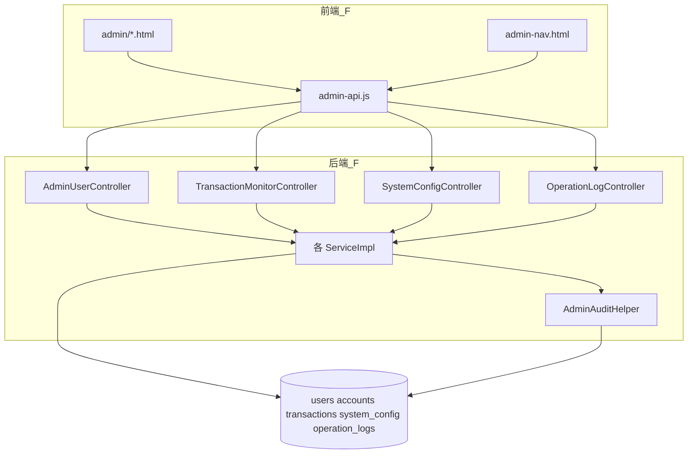

# 成员 F — 管理后台模块 · 代码功能解读报告

> **面向读者**：刚接触本项目的开发者  
> **模块负责人**：成员 F（管理员后台开发）  
> **后端路径**：`project/back/src/main/java/com/bank/admin/`  
> **前端路径**：`project/front/templates/admin/` + `admin-api.js`  
> **文档版本**：2026-06-12

---

## 1. 这个模块是做什么的？

成员 F 负责**银行内部管理人员使用的后台**，包括 API 和完整网页 UI：

| 功能块 | 说明 |
|--------|------|
| 概览 | 用户数、账户数、交易量统计 |
| 用户管理 | 查用户、冻结/启用、重置密码 |
| 账户管理 | 全平台账户查询、冻结 |
| 交易监控 | 全平台流水查询 |
| 系统配置 | 转账限额、手续费率等 |
| 操作日志 | 管理员做了什么，可追溯 |
| 管理员账号 | 创建新管理员 |

**入口**：`admin` / `Admin@123` 登录 → 自动进 `/admin/dashboard`（与 A 的登录分流配合）。

---

## 2. 新手必懂的基础概念

### 2.1 管理员 API 路径

统一前缀 **`/api/admin/**`**，需要：

- 已登录（JWT）  
- 角色 `ROLE_ADMIN`（`@PreAuthorize("hasRole('ADMIN')")`）

普通用户 Token 访问会 403。

### 2.2 两套前端

| 区域 | JS | 导航 |
|------|-----|------|
| 用户前台 | `api.js` | `nav.html` |
| **管理后台** | **`admin-api.js`** | **`admin-nav.html`** |

`admin-api.js` 检查 `data.code === 200`（管理端统一 `Result` 格式），401 跳登录，403 提示无权限。

### 2.3 操作审计 AdminAuditHelper

管理员改用户状态、重置密码等敏感操作后，F 调用 `adminAuditHelper.log(...)` 写入 `operation_logs` 表，供合规追溯。

### 2.4 与用户模块 B 的关系

- 用户数据存在 B 的 `users` 表  
- F 的 `AdminUserService` 通过 `AdminUserRepository` 查询/修改用户  
- 冻结用户时可能联动冻结其下所有 `ACTIVE` 账户（C 的 accounts 表）

---

## 3. 模块架构



页面路由由**成员 A** 的 `PageController` 注册（`/admin/users` 等）。

---

## 4. 后端文件结构（约 35 个 Java 文件）

### 4.1 Controller（REST API）

| 类 | 路径 | 功能 |
|----|------|------|
| `AdminUserController` | `/api/admin/users` | 用户列表、详情、改状态、重置/设置密码、**创建管理员** |
| `TransactionMonitorController` | `/api/admin/transactions` | 全平台交易分页查询 |
| `SystemConfigController` | `/api/admin/configs` | 读写 system_config |
| `OperationLogController` | `/api/admin/operation-logs` | 操作日志分页查询 |

### 4.2 Service

| 类 | 说明 |
|----|------|
| `AdminUserServiceImpl` | 用户管理核心；冻结用户时 `freezeUserAccounts` |
| `TransactionMonitorServiceImpl` | 交易监控查询 |
| `SystemConfigServiceImpl` | 配置 CRUD |
| `OperationLogServiceImpl` | 日志查询 |
| `AdminRuntimeConfigService` | 读取运行时配置（如手续费率），**供 D 转账时调用** |

### 4.3 实体与 DTO

- `SystemConfig`、`OperationLog` 实体  
- 请求：`UserQueryRequest`、`CreateAdminRequest`、`SystemConfigRequest` 等  
- 响应：`UserVO`、`TransactionVO`、`DashboardStatsVO`、`OperationLogVO`、`PageResult`、`Result`

### 4.4 支持类

`AdminAuditHelper` — 封装写操作日志，自动取当前管理员 ID、IP。

---

## 5. 管理端前端（9 个文件）

| 文件 | 页面功能 |
|------|----------|
| `admin/dashboard.html` | 统计卡片：用户总数、账户总数、今日交易等 |
| `admin/users.html` | 用户表格、搜索、改状态、重置密码 |
| `admin/accounts.html` | 全平台账户、冻结/解冻 |
| `admin/config.html` | 编辑 key-value 系统配置 |
| `admin/transactions.html` | 交易流水监控 |
| `admin/operation-logs.html` | 审计日志查询 |
| `admin/admins.html` | 管理员列表、新建管理员 |
| `fragments/admin-nav.html` | 顶栏菜单 + 引入 `admin-api.js` |
| `static/js/admin-api.js` | `adminGet/Post/Put`、`requireAdmin()`、`initAdminNav` |

### admin-api.js 要点

```javascript
async function requireAdmin() {
    const token = localStorage.getItem('accessToken');
    if (!token) { location.href = '/login'; return; }
    // 解析 JWT 或调接口确认 ROLE_ADMIN
}

function initAdminNav() {
    // 高亮当前菜单项；显示管理员用户名
}
```

每个 admin 页面 `DOMContentLoaded` 时先 `requireAdmin()` 再拉数据。

---

## 6. 核心业务流程

### 6.1 冻结用户

`AdminUserServiceImpl.updateUserStatus`：

1. 不能改其他**管理员**账号  
2. `status` 设为 `LOCKED`  
3. 将该用户下所有 `ACTIVE` 账户改为 `FROZEN`  
4. `adminAuditHelper.log("用户管理", "修改用户状态", ...)`

成员 B 的 `checkAccountStatus` 在登录/交易时拒绝 `LOCKED` 用户。

### 6.2 重置用户密码

- 随机生成强密码或管理员指定  
- BCrypt 加密写入 `users`  
- 记审计日志  
- 返回新密码（管理员线下告知用户）

### 6.3 创建管理员

`POST /api/admin/users/admins` + `CreateAdminRequest`：

- 新用户 `role = ROLE_ADMIN`，`status = ACTIVE`，`emailVerified = true`  
- 密码加密存储

### 6.4 系统配置

`system_config` 表存键值，例如：

- `transfer_fee_rate` — 转账手续费率（小数）  
- 其他限额可由配置扩展  

`AdminRuntimeConfigService.getTransferFeeRate()` 被 D 的 `TransactionServiceImpl` 读取。

### 6.5 操作日志查询

管理员在 `operation-logs.html` 按时间、模块、操作人筛选，对应 `OperationLogController` 分页 API。

---

## 7. 主要 API 速查

| 方法 | 路径 | 说明 |
|------|------|------|
| GET | `/api/admin/users` | 用户分页 |
| PUT | `/api/admin/users/{id}/status` | 改状态 |
| POST | `/api/admin/users/{id}/reset-password` | 重置密码 |
| POST | `/api/admin/users/admins` | 创建管理员 |
| GET | `/api/admin/transactions` | 交易监控 |
| GET/PUT | `/api/admin/configs` | 系统配置 |
| GET | `/api/admin/operation-logs` | 操作日志 |

账户管理 API 在**成员 C** 的 `AdminAccountController`（`/api/admin/accounts` 等），F 的前端 `accounts.html` 调用该接口。

---

## 8. 与其他模块协作

| 模块 | 协作 |
|------|------|
| **A** | `/admin/*` 路由；登录后跳转 dashboard |
| **B** | 读写 `users`；管理员角色校验 |
| **C** | `AdminAccountController`；冻结联动账户 |
| **D** | 读交易流水；读手续费配置 |
| **J** | `operation_logs`、`system_config` 表；`admin-extensions.sql` |
| **G** | 用户前台 API 与 admin API 分离，异常处理共用 `GlobalExceptionHandler` |

---

## 9. 本地调试

1. 登录 `admin` / `Admin@123`  
2. 应进入 `/admin/dashboard`，顶栏有「用户管理」「操作日志」等  
3. 在 users 页冻结 `wangwu`，再用 wangwu 登录应失败  
4. 在 operation-logs 页应看到刚才的操作记录  

```bash
mvn test -Dtest=AdminUserServiceTest,SystemConfigServiceTest
```

---

## 10. 推荐阅读顺序

**后端**：

1. `AdminUserController.java`  
2. **`AdminUserServiceImpl.java`**  
3. `AdminAuditHelper.java`  
4. `SystemConfigController` + `AdminRuntimeConfigService`  

**前端**：

1. `admin-api.js`  
2. `admin-nav.html`  
3. `admin/users.html`  
4. `admin/dashboard.html`  

---

## 11. 小结

成员 F 是项目中**文件量最大**的模块（API + 7 页 UI + 审计 + 配置），承担「银行内部运营管理」。后端重点在 `AdminUserServiceImpl` 与四个 Controller；前端重点在 `admin-api.js` 与各 admin 页面的表格/表单交互。与 B/C/D/J 交叉密切，读 F 代码时建议对照用户、账户、配置三张表理解。
