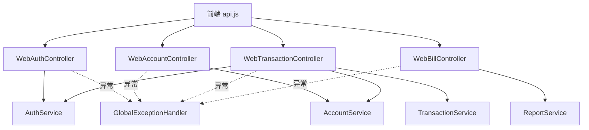

# 成员 G — Web API 集成层 · 代码功能解读报告

> **面向读者**：刚接触本项目的开发者  
> **模块负责人**：成员 G（API 集成工程师）  
> **代码包路径**：`project/back/src/main/java/com/bank/web/` + `com/bank/dto/` + `GlobalExceptionHandler`  
> **文档版本**：2026-06-12

---

## 1. 这个模块是做什么的？

成员 G 是**前端与后端领域模块之间的翻译官 + 总机**：

- 把浏览器发来的 JSON 转成 B/C/D/E 能懂的对象  
- 把领域层结果转成统一 JSON 给前端  
- 集中处理各种异常，返回友好错误信息  

**类比**：B/C/D/E 是后台各部门，G 是**对外营业厅窗口**。

---

## 2. 新手必懂的基础概念

### 2.1 Controller 与 Service 分层

```text
前端 → WebXxxController (G) → XxxService (B/C/D/E) → 数据库
```

G **不写**转账扣款逻辑，只负责：

- 取当前登录用户 `@AuthenticationPrincipal BankUserDetails user`  
- 调 `transactionService.transfer(...)`  
- 包装 `ApiResponse.success(...)`

### 2.2 两套 DTO

| 包 | 用途 |
|----|------|
| `com.bank.dto.*` | **给前端**的 LoginRequest、TransferRequest 等 |
| `com.bank.transaction.dto.*` 等 | **领域内部** DTO，G 负责转换 |

例如 Web 的 `TransferRequest` 用账户**号** `ACC...`，内部 `TransferRequest` 用账户 **ID**。

### 2.3 统一响应 ApiResponse

```json
{
  "code": 200,
  "message": "转账成功",
  "data": { ... }
}
```

失败时 `code` 为 400/401/403 等，`message` 给人看。

### 2.4 GlobalExceptionHandler

带 `@RestControllerAdvice`，捕获全局异常，避免每个 Controller 写 try-catch。

---

## 3. 模块架构



---

## 4. 文件清单（15 个）

### 4.1 控制器

| 文件 | 路径前缀 | 主要接口 |
|------|----------|----------|
| `WebAuthController.java` | `/api/auth` | login, register, verify-email, refresh, logout |
| `WebAccountController.java` | `/api/accounts` | my, 开户, 余额 |
| `WebTransactionController.java` | `/api/transactions` | transfer, deposit, withdraw, **transfer/send-otp** |
| `WebBillController.java` | `/api/bills` | history, export |

### 4.2 前端 DTO

- **request**：`LoginRequest`、`RegisterRequest`、`TransferRequest`、`DepositWithdrawRequest`  
- **response**：`ApiResponse`、`LoginResponse`、`AccountResponse`、`TransactionResponse`、`PageResponse`

### 4.3 全局异常

`GlobalExceptionHandler.java` 处理：

- `BusinessException` → 400 + 业务码  
- `AuthException.*` → 401/400 OTP 相关  
- `AccessDeniedException` → 403 需要管理员  
- `MethodArgumentNotValidException` → 参数校验失败  

---

## 5. 各 Controller 详解

### 5.1 WebAuthController

| 接口 | 调用 |
|------|------|
| `POST /login` | `authService.login` → 转 `LoginResponse` |
| `POST /register` | 校验两次密码一致 → `authService.register` |
| `POST /verify-email` | `authService.verifyEmail` |
| `GET /pending-verification` | 查待验证用户邮箱（脱敏） |
| `POST /refresh` | `authService.refreshToken` |

### 5.2 WebAccountController

| 接口 | 说明 |
|------|------|
| `GET /my` | 当前用户所有账户 |
| `GET /{accountNo}/balance` | 指定账户余额 |
| `POST /` | 开户 |

从 `BankUserDetails` 取 `userId`，保证只能操作自己的账户。

### 5.3 WebTransactionController（重点）

**发转账 OTP** `POST /transfer/send-otp`：

- 需登录  
- `authService.verifyUserActive` + `sendTransferOtp`

**转账** `POST /transfer`：

1. 校验登录、用户状态  
2. `validateTransferOtpIfRequired` — 金额 > `otp-threshold`（默认 5000）必须带 `otpCode`  
3. 账户号规范化、查付款账户（须属于自己）  
4. 校验收款账户号格式（必须 `ACC` 开头，不能误填 `TXN` 流水号）  
5. 调 `transactionService.transfer`  
6. DTO 转换返回

**取款** 额外调用 `authService.verifyLoginPassword` — 需再输登录密码。

### 5.4 WebBillController

转发到 `ReportService`：分页历史、按 format 导出文件流。

---

## 6. GlobalExceptionHandler 示例

```java
@ExceptionHandler(BusinessException.class)
public ResponseEntity<ApiResponse<Void>> handleBusiness(BusinessException ex) {
    return ResponseEntity.status(HttpStatus.BAD_REQUEST)
            .body(ApiResponse.error(ex.getCode(), ex.getMessage()));
}
```

前端 `api.js` 读到非 200 `code` 后 `throw new Error(message)`，页面用 Toast 显示。

---

## 7. 与其他模块协作

| 模块 | G 如何使用 |
|------|------------|
| **B** | 登录、OTP、用户状态、取款密码 |
| **C** | 账户查询、开户 |
| **D** | 转账/存/取款核心 |
| **E** | 账单查询导出 |
| **A/H** | 前端调 G 暴露的所有 `/api/**` |
| **F** | 管理 API 在 `/api/admin/**`，**不在 G 包内**（F 自己的 Controller） |

---

## 8. 本地调试

用 Swagger：`http://localhost:8080/swagger-ui.html`（A 配置的 OpenAPI）

或 Postman：

1. `POST /api/auth/login` 拿 Token  
2. Header 加 `Authorization: Bearer ...`  
3. 调 `/api/transactions/transfer`

---

## 9. 推荐阅读顺序

1. `com/bank/dto/response/ApiResponse.java`  
2. `WebAuthController.java`  
3. **`WebTransactionController.java`**（最复杂）  
4. `WebBillController.java`  
5. `GlobalExceptionHandler.java`  

---

## 10. 小结

成员 G 不实现银行核心业务，但**没有 G，前端就无法规范地调用 B/C/D/E**。重点是四个 Web Controller + 全局异常 + DTO 适配，其中转账接口串联了 B、C、D 三个模块。
